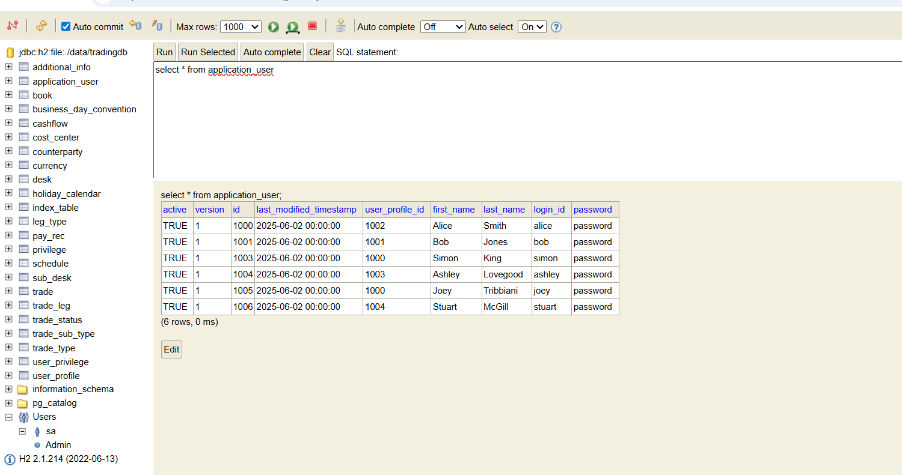
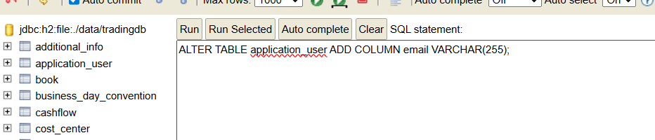

## Project Setup problems

FrontEnd is not running on port 3000

saksa@Work-Sak MINGW64 ~/cbfacademy/trade-capture-system/frontend (main)
$ npm run dev

> frontend@0.0.0 dev
> vite

VITE v6.3.6 ready in 612 ms

➜ Local: http://localhost:5173/
➜ Network: use --host to expose
➜ press h + enter to show help

Problem was the default viteport is 5173. I changed the port to 3000 inside the package.json
scripts": {
"dev": "vite --port 3000",
"build": "pnpm lint && vite build",
"lint": "eslint .",
"preview": "vite preview",
"test": "vitest"
},

saksa@Work-Sak MINGW64 ~/cbfacademy/trade-capture-system/frontend (main)
$ npm run dev

> frontend@0.0.0 dev
> vite --port 3000

I tried to login but there is no email field in database. I had to add email field and insert some emails. The log_in id serves as te email which can confuse the users, so I should either change the database and authentication or change the form.


UPDATE application_user SET email='simon@example.com' WHERE login_id='simon';
UPDATE application_user SET email='ashley@example.com' WHERE login_id='ashley';
Update application_user Set email='joey@example.com' WHERE login_id='joey';
UPDATE application_user SET email='stuart@example.com' WHERE login_id='stuart';

## Test Failure testCashflowGeneration_MonthlySchedule , TradeServiceTest

### Problem Description: What was failing and why

[ERROR] com.technicalchallenge.service.TradeServiceTest.testCashflowGeneration_MonthlySchedule -- Time elapsed: 0.007 s <<< FAILURE!
org.opentest4j.AssertionFailedError: expected: <1> but was: <12>
assertEquals(1, 12); // This was checking if 1 =12! which will always fail
test method did not call the method under test.
The required fields for the monthly schedule was not set up.
The assertion does not verify the number of cashflows

### Root Cause Analysis: The underlying issue causing the test failure

1. assertEquals(1, 12); // This was checking if 1 =12! which will always fail.It was not checking cash flow logic
2. Missing the call of the method under test:generateCashflows method to test the cashflow generation logic.
3. Test was incomplete also as only TradeLeg is created by setting up test data by assigning value to the notional field of the TradeLeg object, I need to set all fields that generateCashflows uses, otherwise it may not work or may use defaults.

### Solution Implemented: How it is fixed the issue and why this approach was chosen

1. created a TradeLeg and Added the other Other required fields: schedule, rate
2. Called to the generateCashflows(leg, startDate, maturityDate) with appropriate dates. When I tried to call the method generateCashflows, it was not visible as it was defined as private. I had to change it to public.
3. Changed the assertion so the returned cashflows match the expected monthly schedule
4. Tested the correct number of cashflows are generated and if their values/dates are correct. Used Mockito to verify that cashflowRepository.save() was called 12 times matching the expected number of monthly cashflows for 1 year period.
5. I replaced assertEquals with verify() in Mockito, as I do not know the number of generated cashflows, I could get them from a list or create a method that returns a list of chashflows repository, I needed to count them by using list size. This is a long process to capture saved chashflows
   Tested the dates and values.
6. Doing all of the above the test still failed as the cashflowRepository.save(...) only called3 times as in service class generateCashflows method, calls getSchedule() from Schedule class and parse Schedule and that the default Schedule is '3M' quarterly. I had to set the schedule string to "Monthly" by passing this to setSchedule for test to generate monthly cashflows.
7. Then I discovered another problem When I fixed everything in that method,

### I encountered another problem:

It was generating 11 months instead 12 LocalDate
-> at com.technicalchallenge.service.TradeServiceTest.testCashflowGeneration_MonthlySchedule(TradeServiceTest.java:197)
But was 11 times:
The code generated cashflows for each month from January to December, but the end date is exclusive, it will only create 11 cashflows.

### Solution to the new problem

I had to change maturity date instead of 31 December to 1 JAN 2026.LocalDate `java maturityDate = LocalDate.of(2026, 1, 1);` This works for now but I believe I need to think about Febraury Month and next month to it, especially if start date and maturity dates are both middle of the month.

### Impact Verification: How I confirmed the fix works:

I ran the tests again mvn targeting only this test mvn -Dtest=TradeServiceTest#testCashflowGeneration_MonthlySchedule test
and it passed and correctly shows the cashflow generation for a monthly schedule

## Test Failure testCreateTradeLegValidationFailure_NegativeNotional , TradeLegControllerTest

### Problem Description: What was failing and why

[ERROR] com.technicalchallenge.controller.TradeLegControllerTest.testCreateTradeLegValidationFailure_NegativeNotional -- Time elapsed: 0.017 s <<< FAILURE!
java.lang.AssertionError: Response content expected:<Notional must be positive> but was:<>

When TradeLegDTO POST request is made with a negative notional, the API should return a 400 bad request and display message "Notional must be positive", but the response is empty.

### Root Cause Analysis: The underlying issue causing the test failure

Since this class is testing the TradeLegController, I checked the reason why empty string is printed in the controller. I also followed the setNotation method and checked the TradeLeg model, dto, mapper and service class.

#### Root cause assumption 1:

Firstly, I though that there was that there is no validation in the controller but I found that in the createTradeLeg method the controller does validate the notional value. If the notional is negative or zero, it will return a bad request with the message. I checked all other classes if there was any logic or validation that adjusts the Notional value. I found annotations @NotNull and @Positive which should get Spring’s bean validation kicked in.The controller has @Valid which is making the annotations in the DTO to work.

#### Root cause assumption2:

The test was expecting "Notional must be positive" but by default Spring returns JSON format not a plain string but the test expects a string andExpect(content().string("Notional must be positive")): This asserts that the response body contains the expected error message. I thought that Spring Boot response may be wrapped in quotes, or returned as JSON, or with extra whitespace and Jackson may serialize the string as "Notional must be positive" with quotes. I changed the test method to expect "\"Notional must be positive\"" backslash is just for escaping quotes with quotes to deal with a possible mismatch between the expected and actual response format due to Spring’s JSON message conversion.
I tested the method and The test still failed after this change mvn -Dtest=TradeLegControllerTest#testCreateTradeLegValidationFailure_NegativeNotional test.
still fail and showed [ERROR] TradeLegControllerTest.testCreateTradeLegValidationFailure_NegativeNotional:168 Response content expected:<"Notional must be positive"> but was:<>

#### Actual Root cause:

I used Java debugger and the debug output shown that the request is mapped to TradeLegController#createTradeLeg(TradeLegDTO). The TradeLegDTO is deserialized with a negative notional. Spring’s bean validation triggers before the manual validation code in the controller. Spring’s default behaviour for validation errors is to return a 400 status with an empty body. The exception MethodArgumentNotValidException is thrown because the @Positive annotation on notional fails. The error message is "Notional must be positive", but the response body is empty and the content type is null.

Why the test fails:
When a negative notional is sent in the test, Spring’s validation detects that it violates the @Positive constraint and throws a MethodArgumentNotValidException before the controller logic runs.The test failed because Spring’s default validation handling returned a 400 with an empty body, instead of the expected error message.
The test expects the error message in the response body.
Spring returns an empty body for validation errors by default.

### Solution

After researching why the exception handling in the TradeLegController is
not invoked, I came across this StackOverflow post:https://stackoverflow.com/questions/66371164/spring-boot-exceptionhandler-for-methodargumentnotvalidexception-in-restcontroll?
I had to read about the topic more to understand the @RestControllerAdvice
public class ValidationExceptionHandler {
@ExceptionHandler(MethodArgumentNotValidException.class)
public ResponseEntity<String> handleValidationException(MethodArgumentNotValidException ex) {
String message = ex.getBindingResult().getFieldError().getDefaultMessage();
return ResponseEntity.badRequest().body(message);
}
} https://www.baeldung.com/global-error-handler-in-a-spring-rest-api?

https://medium.com/javaguides/spring-boot-restcontrolleradvice-annotation-complete-guide-with-examples-5254a4f6f62d

I added a custom exception handler to return the error message in the response body for validation errors, to ensure that when validation fails, the error message (e.g., "Notional must be positive") is returned in the response body, and the test will pass.
After added a ValidationExceptionHandler class with @RestControllerAdvice and an @ExceptionHandler(MethodArgumentNotValidException.class) method. This intercepted validation exceptions, extracted the message (e.g., “Notional must be positive”), and returned it in the response body. This fixed the issue by making the response include the validation error message, so the test passed.

### Impact

With the custom `ValidationExceptionHandler` in place, any validation errors (such as a negative notional) now return a proper `400 Bad Request` along with the specific validation message in the response body. This ensures tests expecting `"Notional must be positive"` pass, improves API usability for clients by providing clear error feedback, and standardises validation error handling across controllers.

## Test Failure TradeServiceTest.testAmendTrade_Success – NullPointerException due to unstubbed repository.

I am not sure if this was in the original test failures or introduced after I fixed another test

### Problem

[ERROR] TradeServiceTest.testAmendTrade_Success:216 » NullPointer Cannot invoke "com.technicalchallenge.model.TradeLeg.getLegId()" because "leg" is null.
The test testAmendTrade_Success was failing:
NullPointerException: Cannot invoke "com.technicalchallenge.model.TradeLeg.getLegId()" because "leg" is null.
This happened when the service called generateCashflows(savedLeg, ...) inside the amend path.

### Root cause

Mockito returns null for unstubbed methods. I did not stub tradeLegRepository.save, so the savedLeg was null. When generateCashflows ran, it immediately accessed leg.getLegId(), causing the NullPointerException (NPE).
Additionally, the amended status was not guaranteed to exist unless unless I stubbed tradeStatusRepository.findByTradeStatus("AMENDED"), which could lead to “status not found” errors in other runs.

### Solution

The amend path, which runs inside TradeService.amendTrade(...), needed explicit stubbing. Without proper stubbing, Mockito returns null for repository calls that aren’t explicitly mocked. That’s what caused the NullPointerException. To make the amend path stable and predictable, I stubbed the repository calls explicitly, so they always return a valid object instead of null.

```java when(tradeStatusRepository.findByTradeStatus("AMENDED"))
    .thenReturn(Optional.of(amended));
```

I ensured tradeRepository.findByTradeIdAndActiveTrue(100001L) returns an existing trade with a non-null version so the service can increment it. I made tradeRepository.save(...) return the same object that was passed in, so I can verify both saves (deactivate old + save amended) without over-constraining the test:
Then I fixed the TradeLeg save to never return null and to have a non-null legId, which generateCashflows(...) needs. I then exercised the amend flow and asserted version bump and the two saves.

### Impact

## TradeServiceTest.testCreateTrade_InvalidCurrencyCode – IllegalArgumentException: Unknown currency code 'UK'

### Problem:

The test failed with  
 `java.util.IllegalArgumentException: Unknown currency code: UK`  
 when creating a TradeLeg with `leg2.setCurrency("UK")`.

- Root Cause:  
  in Java, the class `java.util.Currency` only accepts **valid ISO 4217 currency codes** such as `"USD"`, `"EUR"`, `"GBP"`. `"UK"` is a country code, not a currency code, so the `Currency.getInstance("UK")` call failed. Because the test data was using `"UK"`, the mapping layer or validation logic in the service could not create a valid `Currency` object.

### Solution

I corrected the test setup to use `"GBP"` (the proper ISO currency code for British Pounds) instead of `"UK"`.

`````java
leg2.setCurrency("GBP");``` // FIX: replaced invalid "UK" with correct ISO code

### Impact:
With a valid code, the trade legs are now correctly created, mapped, and passed into the service.
This removes the IllegalArgumentException, allows the tests to run through the TradeService methods, and ensures that downstream processes such as cashflow generation can execute successfully.

## Test failure testAmendTrade_Success: NullPointerException

### Problem Description: What was failing and why:

Cannot invoke "java.lang.Integer.intValue()" because the return value of "com.technicalchallenge.model.Trade.getVersion()" is null

The test calls the service method, which calls getVersion() on the test's mock Trade object. If the mock's version field is not set, getVersion() returns null. The service then tries to increment the version: existingTrade.getVersion() + 1. Adding 1 to null causes a NullPointerException.

### Root cause:

The test calls the service method, which calls getVersion() on the test's mock object. If the mock's version is not set, this leads to a NullPointerException when the service tries to increment it. The root cause is missing test data initialisation. Following the problem through:
The test method testAmendTrade_Success, calls tradeService.amendTrade inside amendTrade, the service calls getTradeById(tradeId) to fetch the existing trade. The returned Trade object is assigned to existingTrade.The service then calls existingTrade.getVersion() to get the current version.
If the test did not set the version field on the mock Trade object, getVersion() returns null. The service tries to increment the version: existingTrade.getVersion() + 1. Adding 1 to null causes a NullPointerException.

### Solution:

In the test setup, I set the version field for the mock Trade object:

````java
trade.setVersion(1);```
I also ensured the stub is in that test testCreateTrade_Success and not only in @BeforeEach ```java when(bookRepository.findByBookName("TestBook"))
.thenReturn(Optional.of(new Book()));

`````

### Impact

This ensures that getVersion() returns a valid integer, so the service can safely increment it.

## Test Failure RuntimeException 'Book not found or not set' in testCreateTrade_Success

Even though I had lenient().when(bookRepository.findByBookName("TestBook")), the DTO has bookName = "TestBook", but the service expects a book and fails if Optional.empty(). The stub was not guaranteed to be in effect for this specific test. The service requires bookRepository.findByBookName(dto.getBookName()) to return a Book, otherwise it throws an exception. Since the repository returned Optional.empty(), the test failed.

### Root Cause:

The service expects a Book to be set on the Trade, but the test data does not provide one, and the repository mock does not return a Book. When the service calls bookRepository.findByBookName(tradeDTO.getBookName()), it gets Optional.empty(), so it throws a RuntimeException.

###Solution:
In the test setup, I set a book name in the DTO and mock the repository to return a Book. I ensured also the stub is in that test and not only in @BeforeEach::-------

```java
tradeDTO.setBookName("TestBook");
when(bookRepository.findByBookName("TestBook")).thenReturn(Optional.of(new Book()));
```

### Impact

This ensures the service finds a Book and does not throw the error.

## Test Failure in TradeServiceTest.testCreateTrade_Success – Counterparty Not Found

### Problem Description

The test for trade creation (testCreateTrade_Success) was failing with a RuntimeException: Counterparty not found or not set. This error occurred when the service attempted to validate reference data for a new trade, but could not find a valid counterparty.

### Root Cause:

The test data (tradeDTO) included a counterparty name, but the mock repository (counterpartyRepository) was not set up to return a valid Counterparty object for that name. As a result, when the service called counterpartyRepository.findByName("TestCounterparty"), it received an empty result (Optional.empty()), causing the service to throw an exception during validation.

### Solution

To resolve the error, I updated the test setup to ensure the service could find a valid counterparty:
-Set the Counterparty Name in Test Data:
I assigned "TestCounterparty" to the counterpartyName field of the tradeDTO object. This matches what the service expects when looking up a counterparty.

- Mocked the Repository to Return a Valid Counterparty:
  I used Mockito to configure the mock repository: `java when(counterpartyRepository.findByName("TestCounterparty")).thenReturn(Optional.of(new Counterparty()));  `. This tells the mock repository to return a valid Counterparty object whenever the service looks up "TestCounterparty" by name.

### Impact

By properly setting up the mock to return a valid counterparty, the test now simulates a successful database lookup. This enables the service to validate and process trades as expected, ensuring that trade creation logic is correctly tested and validated in isolation from the database.

## Test Failure Recurring Problem in TradeServiceTest.testCreateTrade_Success – Trade Status Not Found

### Problem

testCreateTrade_Success:121 » Runtime Trade status not found or not set

### Root Cause previously

TradeService code is expecting a Trade status when to create a trade. The test was failing because no status has been set, or the status is null. It seemed that I am calling tradeService.createTrade(trade) without properly mocking or setting the status

### Previous solution

I created an object of trade and set the status tp the new object.

```java
Trade trade = new Trade();
trade.setStatus(TradeStatus.NEW);
```

and I also mocked it inside the method under test.

### Root Cause Now The problem reoccurred

The `when(tradeStatusRepository.findByTradeStatus("NEW"))` mock was originally defined only inside the testCreateTrade_Success method. As a result, other tests such as amendTrade did not have this stub available, leading to a NullPointerException when the service tried to fetch the trade status.

### Solution

Explanation for moving the tradeStatusRepository mock to @BeforeEach:
By moving this mock to the `@BeforeEach` setup method, we ensure that: Consistency across all tests

### Impact

– Every test now automatically has a valid mock for` tradeStatusRepository.findByTradeStatus("NEW")`.-Elimination of redundancy – There’s no need to repeat the same when(...) statement in multiple test methods.
-Reduced risk of NullPointerException – Any test that calls createTrade or amendTrade can safely assume that the required trade status reference data is available.
-Cleaner and more maintainable test code – Centralizing common mock setups in @BeforeEach improves readability and maintainability. This change makes the tests more robust, DRY, and easier to manage.

## Test Failure in TradeServiceTest.testCreateTrade_Success – NullPointerException on Currency/Leg Handling

### Problem

`Cannot invoke "com.technicalchallenge.repository.CurrencyRepository.findByCurrency(String)"
because "this.currencyRepository" is null.`

Additionally, the test was failing with a `NullPointerException` inside `TradeService.createTrade()`.
The crash occurred during cashflow generation when the service attempted to call `leg.getLegId()` on a `null` object.

### Root Cause

In the `TradeService`, after saving a `Trade`, the method `createTradeLegsWithCashflows()` is invoked.
This method saves each `TradeLeg` via `tradeLegRepository.save(leg)` and then immediately calls `generateCashflows` with the returned object.

However:

- `currencyRepository` was not injected or mocked in the test setup, causing `currencyRepository.findByCurrency()` to throw a `NullPointerException`.
- `tradeLegRepository.save()` was not stubbed in the test setup. By default, Mockito returns `null` for unstubbed calls. That meant the returned `TradeLeg` was `null`, and when the service attempted to call `leg.getLegId()`, it failed.

### Solution

1. Ensured that `currencyRepository` was correctly mocked and injected in the test context.
2. Stubbed the `tradeLegRepository.save(any())` call to return a non-null `TradeLeg` with a synthetic ID for test stability:

```java
when(tradeLegRepository.save(any(TradeLeg.class))).thenAnswer(invocation -> {
    TradeLeg saved = invocation.getArgument(0);
    if (saved.getLegId() == null) {
        saved.setLegId(999L); // Synthetic ID for stability in tests
    }
    return saved;
});
```

### Impact

Prevents NullPointerException by ensuring required repository dependencies are mocked.
Guarantees that every saved TradeLeg in tests has a valid legId, allowing generateCashflows to run successfully.
Provides more realistic behaviour in unit tests, simulating how a real database would assign IDs to entities.
Improves test reliability and stability across the service layer.

# Unnecessary Stubbing Problems and Fixes

## Overview

Several of the failing tests were not due to logic errors, but because of **Mockito’s strict stubbing mode**.
Mockito requires that every stubbed method (`when(...).thenReturn(...)`) is invoked during a test run. for example i stubbed this when in the setup, but not all tests use this. `java when(bookRepository.findByBookName("TestBook")).thenReturn(Optional.of(new Book()));`
If a test does not reach the code that calls those stubs (e.g., it fails early in validation), Mockito throws an `UnnecessaryStubbingException`.

## Tests Affected by Unnecessary Stubbing

- **testCreateTrade_InvalidDates_ShouldFail**
- **testCreateTrade_InvalidLegCount_ShouldFail**
- **testGetTradeById_Found**
- **testGetTradeById_NotFound**
- **testAmendTrade_TradeNotFound**
- **testCashflowGeneration_MonthlySchedule**

---

## Example Problem

### Problem Description:

In `testCreateTrade_InvalidDates_ShouldFail`, the test only checks the validation rule that the trade start date must not be before the trade date.
Because the validation fails immediately, the service never calls repository methods like `bookRepository.findByBookName` or `currencyRepository.findByCurrency`.

### Root Cause:

- To follow DRY principles, all repository stubbings were placed inside `@BeforeEach`.
- Mockito’s **strict mode** flagged any unused stubs as errors.
- Example: stubbing `bookRepository.findByBookName(...)` was only needed in `testCreateTrade_Success` but existed for all tests.
  These stubs, defined in `@BeforeEach`, were marked by Mockito as "unused". Since strict stubbing is the default, Mockito fails the test with `UnnecessaryStubbingException`.

---

### Root Cause Pattern Across Tests

- Some tests only validate business rules (e.g., invalid dates, missing legs). They never reach repository logic.
- Some tests bypass the service flow (e.g., direct `generateCashflows` call), so repositories are irrelevant.
- In these cases, global stubs created in `setUp()` are unused, triggering the failure.

---

### Solution

Use lenient stubbing at the class level so that unused stubs don’t break tests. `@MockitoSettings(strictness = Strictness.LENIENT)` at the class level. This allowed common stubbings to remain in `@BeforeEach` without breaking tests that didn’t use them.

### Change Applied

```java
import org.mockito.quality.Strictness;
import org.mockito.junit.jupiter.MockitoSettings;

@ExtendWith(MockitoExtension.class)
@MockitoSettings(strictness = Strictness.LENIENT)  // Added
class TradeServiceTest {
}
```

### Impact

- Shared stubbing logic could be preserved without duplication.
- DRY principles were maintained while preventing strict stubbing failures.

WhY I used lenient:
I had a shared @BeforeEach setup with stubs that are needed in some tests but not in others. I was trying to to avoid duplicating stubs in every single test so I moved Mocks that more than one test is using in the @Beforeeach method but introduced new errors regarding unnecessary stubbing. That is why I used lenient to tell Mockito that it is OK some repositories mocks are not used in all test methods.

### Test Failure in TradeControllerTest.testCreateTrade – Status expected:<200> but was:<201>

#### Problem

TradeControllerTest testCreateTrade Status expected:<200> but was:<201>. The controller returns ResponseEntity.created(...).and Test expects ok().

### Solution: Decide if the controller is correct (201 Created for POST) and update the test to expect

### Root Cause:

The test expects 200 OK, but the controller/service actually returns 201 CREATED (Spring’s default when creating new entities).

### Solution:

I had to decide if the controller is correct (201 Created for POST) and update the test to expect 201, or change controller to return 200. I changed isOK to isCreated. `java .andExpect(status().isCreated()) ` as POST (create new resource), the most REST-correct response is 201 Created which signals: A new resource was successfully created.

### Impact:

The test returns 201 instead of 200

### Test Failure in TradeControllerTest.testCreateTradeValidationFailure_MissingBook – Status expected:<400> but was:<201>

### Problem: method testCreateTradeValidationFailure_MissingBook

Status expected:<400> but was:<201>

### Root Cause:

The controller is returning 201 Created even when the request body is missing required fields (book).Because validation annotations `(@Valid, @NotNull)` are missing on TradeDTO fields or the controller parameter.

### Solution

I Added validation annotations in DTO `Java @NotBlank(message = "Book name is required")`
I have also checked if controller uses @Valid on the Post request body and it does, so no change there.

### Impact

The test see 400 Bad Request in the testDeleteTrade

### Test Failure in TradeControllerTest.testDeleteTrade – Status expected:<204> but was:<200>

### Problem

Status expected:<204> but was:<200> in testDeleteTrade

### Root Cause

Deletion endpoints usually return 204 No Content. But, the controller currently returns 200 ResponseEntity.ok().
I checked the controller and it does this:
`java return ResponseEntity.ok().body("Trade cancelled successfully"); ` which returns 200 OK + a message body, while the test expects: `java .andExpect(status().isNoContent());`
To to follow REST best practices, the controller should return 204 No Content for a successful delete.

### Solution

I changed it inside the delete method in the controller so if successful to return 204 and nobody message return ResponseEntity.noContent().build(); /Changed to 204, no body. Also, if not successful, to return 400 with no body `java return ResponseEntity.badRequest().build();`

### Impact

The controller now returns 204 which os the correct http response for delete

### Test Failure in TradeControllerTest.testCreateTradeValidationFailure_MissingTradeDate – Response content expected:<Trade date is required> but was:<>

### Problem

The test expected the response body to contain "Trade date is required", but the actual response body was empty.

### Root Cause:

The tradeDate field in TradeDTO did not have any validation annotations `(@NotNull or @NotBlank)`. The controller method had `@Valid`, but without field-level constraints, Spring’s validation framework never triggered. As a result, the request was accepted silently and returned an empty response body instead of the validation error message.

### Solution:

Added field-level validation to the DTO:

```java
@NotNull(message = "Trade date is required")
private LocalDate tradeDate;
```

Kept `@Valid` in the controller so the constraint is enforced.

### Impact

Validation now fails correctly when tradeDate is missing, and the error message "Trade date is required" is returned in the response body.
The test passes.

## Test Failure in TradeControllerTest.testUpdateTrade – No value at JSON path "$.tradeId"

### Problem

No value at JSON path "$.tradeId" inside testUpdateTrade. The JSON response doesn’t contain tradeId.

### Root cause

The update endpoint isn’t returning the saved trade as JSON.comes from a Spring MockMvc test checking the JSON body after calling the update (amend) endpoint. The test expected the response JSON but controller was returning nothing empty body.

### Solution

Either test should expect empty response, or controller should return DTO with tradeId.I have chosen to fix controller to return the updated Trade (or DTO) as JSON

```java
return ResponseEntity.ok(responseDTO);
```

### Impact

The update endpoint now returns the amended trade details as JSON, including the tradeId.
This aligns the API response with the test expectations and ensures clients receive confirmation of the updated trade, improving both correctness and usability.

## Test Failure in TradeControllerTest.testCreateTradeValidationFailure_MissingTradeDate – Response content expected:<Trade date is required> but was:<>

### Problem

Response content expected:<Trade date is required> but was:<>. The test expected the response body to contain "Trade date is required". Instead, the response body was empty ("").

### Root Cause

Missing validation. Validation isn’t bubbling the error message.It seems the controller doesn’t return field validation messages. The tradeDate field in the TradeDTO (or equivalent request object) was not annotated with validation constraints like `@NotNull` or `@NotBlank`.

I firstly checked if method is using @Valid and @ExceptionHandler(MethodArgumentNotValidException) in the controller. As if not, test will always get an empty body. Although the controller had @Valid on the request parameter, without field-level validation annotations, Spring’s validation framework had nothing to trigger.As a result, the request passed silently, and the controller returned an empty body instead of the expected error message.

### Solution

Added a @NotNull(message = "Trade date is required") annotation to the tradeDate field in TradeDTO.

### Impact

This ensures that validation fails if the trade date is missing, and the error message "Trade date is required" is returned in the response body so the test passes.

## Test Failure in TradeControllerTest.testUpdateTradeIdMismatch – Expected 400 but was 200

#### Problem

Status expected:<400> but was:<200>

### Root Cause

The test expected the controller to reject the request with a 400 Bad Request. But the controller processed it and returned 200 OK. Because nowhere in the controller wis checking if the tradeId in the URL path matched the tradeId in the JSON body.The test intentionally passes a mismatching tradeId (URL param vs body). Controller currently ignores mismatch and processes update.

### Solution

Added a check in controller:

```Java
 if (tradeDTO.getTradeId() != null && !id.equals(tradeDTO.getTradeId())) {
     return ResponseEntity.badRequest().body("Trade ID mismatch");
 }
```

If the caller tries to update /api/trades/1 but the body says "tradeId": 2 that’s invalid. Instead of trying to process it, the controller immediately responds with 400 Bad Request.

### Impact

The test expected 400 because it simulated exactly that mismatch case.
But the controller wasn’t enforcing it. Now, with the check, the controller enforces the rule , the test sees 400 and test passes.

# TradeControllerTest – Failures and Fixes

## Test Failure in TradeControllerTest.testCreateTrade – Wrong Status Code and Missing tradeId

### Problem

The test expected HTTP 200 (`status().isOk()`), but the controller was returning HTTP 201 (`status().isCreated()`).

Additionally, the JSON response sometimes didn’t contain `"tradeId"`, which caused assertion failures.

### Root Cause

1. By REST conventions, `@PostMapping` for creating a resource should return **201 Created**, not 200 OK. The test was incorrectly written to expect 200.
2. The missing `"tradeId"` happened because the stubbed `Trade` entity (`trade`) in the test didn’t have its `tradeId` set, even though the `tradeDTO` did. The mapper converts from the `Trade` entity to DTO, so if `trade.getTradeId()` was `null`, the JSON response had no `tradeId`.

### Solution

1. Updated the test to use `.andExpect(status().isCreated())` instead of `.isOk()`.
2. Set `trade.setTradeId(1001L);` in the test setup to ensure that the entity has the expected ID before being mapped back to a DTO. The controller maps the Trade entity to a DTO for the response. If tradeId is not set on the entity, the response JSON will be missing tradeId, causing tests that assert on this field to fail. Setting tradeId here guarantees the response includes the correct value for test verification.

### Impact

- The test now correctly reflects RESTful behavior by expecting **201 Created** for resource creation.
- Ensures that the response payload always contains `tradeId`, making the test stable.
- Improves consistency between the controller, service, and test expectations.

## Test Failure in TradeControllerTest.testUpdateTrade – Missing tradeId in JSON Response

### Problem

The JSON response didn’t contain `"tradeId"`, causing the assertion `.andExpect(jsonPath("$.tradeId", is(1001)))` to fail.

### Root Cause

The stubbed `Trade` entity (`trade`) used in the test didn’t have its `tradeId` set. Even though `tradeDTO.setTradeId(1001L)` was called, the controller maps **from the entity**, not directly from the DTO. Since the `Trade` entity had `null` for `tradeId`, the mapper produced a DTO without `tradeId` in the response.

### Solution

Explicitly set `trade.setTradeId(1001L);` in the test setup to keep the entity in sync with the DTO.

### Impact

- Guarantees that the JSON response always includes `tradeId`.
- Aligns test expectations with actual controller output.
- Prevents confusion where DTO values exist but entity values are `null`.

## Test Failure in TradeControllerTest.testUpdateTradeIdMismatch – Path ID and Body ID mismatch not validated

### Problem

The test expected a `400 Bad Request` when the path ID and body `tradeId` don’t match, but originally the controller didn’t perform this validation and returned `200 OK`.

### Root Cause

The controller’s `updateTrade` method didn’t check for mismatched IDs. It always attempted to update using the `pathVariable`, ignoring inconsistencies in the request body.

### Solution

Added validation logic in the controller:

```java
if (tradeDTO.getTradeId() != null && !id.equals(tradeDTO.getTradeId())) {
    return ResponseEntity.badRequest().body("Trade ID mismatch");
}

```

### Impact

With the new validation logic, the controller now enforces consistency between the path variable and the body field.  
This prevents accidental or malicious updates to the wrong trade, improves data integrity, and ensures the test correctly passes with a `400 Bad Request` when IDs do not match.

## Additional Failure in TradeServiceTest.testAmendTrade_Success – NullPointerException caused by null TradeLeg during cashflow generation

### Problem: NullPointerException in `amendTrade`

- `testAmendTrade_Success` failed with an NPE inside `generateCashflows`.
- Error message: `Cannot invoke "TradeLeg.getLegId()" because "leg" is null`.

### Root Cause: Null legs during cashflow generation

That means the trade object doesn’t have legs when the service tries to copy/amend them.

- `createTradeLegsWithCashflows` iterated over `trade.getTradeLegs()`.
- When legs were `null` or incomplete, the loop crashed.

### Solution: Add null safety

Firstly I introduced guard clauses:

```java
if (leg == null) {
    logger.warn("Skipping null TradeLeg while creating cashflows");
    continue;
}
```

Finally I added legs to trade before amendment in the test class setup

```java eg = new TradeLeg();
leg.setLegId(1L);
trade.setTradeLegs(Arrays.asList(leg));
```

### Impact

Now trade object had a leg which shows the null issue

## BookServiceTest – NullPointerException due to missing BookMapper dependency

### Problem

Cannot invoke "BookMapper.toEntity(BookDTO)" because "bookMapper" is null
Several tests in `BookServiceTest` were failing with `NullPointerException`.
The failures appeared in:

- `testFindBookById`
- `testSaveBook`
- `testFindBookByNonExistentId`

The error messages pointed to calls like `bookMapper.toDto(...)` or `bookMapper.toEntity(...)` on a `null` reference.

### Root Cause

The `BookService` depends on `BookMapper`, which in turn requires `CostCenterRepository`.
In the unit tests, only `BookRepository` was mocked. The `BookMapper` dependency was never provided, leaving it as `null` when `BookService` tried to use it. This caused every test that called `bookMapper` to fail with `NullPointerException`.

### Solution

- Added a `@Mock` for `BookMapper` in `BookServiceTest`. ```java
  @Mock
  private BookMapper bookMapper;
  @InjectMocks
  private BookService bookService;

- Injected it into BookService using @InjectMocks.
- Stubbed mapper calls where necessary (e.g.,
  ``java when(bookMapper.toDto(any(Book.class))).thenReturn(bookDTO) and when(bookMapper.toEntity(any(BookDTO.class))).thenReturn(book))`.

This ensured that BookService`could safely use its mapping logic during tests without throwing exceptions.

### Impact

- All failing tests in `BookServiceTest` (`testFindBookById`, `testSaveBook`, and `testFindBookByNonExistentId`) now pass.
- Existing tests that did not rely on the mapper (`testDeleteBook` and `testBookCreationWithNullNameThrowsException`) continued to pass.
- The test suite now fully validates `BookService` without runtime errors, confirming that book retrieval, saving, and non-existent lookups behave as expected.

## Actuator Health Check – Missing spring-boot-starter-actuator dependency

### Problem

```java
 return 404

```

the actuator endpoints simply aren’t registered

### Root Cause

Backend API won't start after fixing all errors there is no spring-boot-starter-actuator dependency in the dependencies list. That’s why requests to /actuator/health.

### Solution

I had to add this dependency to pass the health check to the POM file

```java
<dependency>
<groupId>org.springframework.boot</groupId>
<artifactId>spring-boot-starter-actuator</artifactId>
</dependency>
```

#### Impact

http://localhost:8080/actuator → show a JSON with all endpoints.

http://localhost:8080/actuator/health → show {"status":"UP"}.

### Impact

- The application now exposes standard Spring Boot Actuator endpoints.
- `/actuator/health` correctly returns `{"status":"UP"}`, confirming that the backend is running.
- Provides visibility into application health, which is useful for monitoring, integration tests, and deployment checks.
- Resolves the 404 errors previously seen when accessing `/actuator/*` endpoints.

### all tests now pass and I merged all branches to main and tested mvn clean test

```java
[INFO] Tests run: 5, Failures: 0, Errors: 0, Skipped: 0, Time elapsed: 0.018 s -- in com.technicalchallenge.service.UserServiceTest
[INFO]
[INFO] Results:
[INFO]
[INFO] Tests run: 58, Failures: 0, Errors: 0, Skipped: 0
[INFO]
[INFO] ------------------------------------------------------------------------
[INFO] BUILD SUCCESS
[INFO] ------------------------------------------------------------------------
[INFO] Total time: 29.757 s
[INFO] Finished at: 2025-10-02T11:12:05+01:00
[INFO] -------------------------------------
```

## Problems after all tests passed and api is not starting.

I have problems that I need to fix. Mostly warnings but some are stopping the api to run

### Main serious issue is

`java Expected Domain ID type is 'com.technicalchallenge.model.UserPrivilegeId' `
from UserPrivilegeRepository.

### Root cause

I clicked the error and The UserPrivilegeRepository is declared with the wrong ID type, Spring Data JPA is failing to start the application context (which means the API won't run).
public interface UserPrivilegeRepository extends JpaRepository<UserPrivilege, Long> {}

I then checked the UserPrivilege. java class to check the type of the UserPrivilege is and it seems that it is marked by @IdClass. It seems that primary key is not just a Long, but a composite key class called UserPrivilegeId.
Because UserPrivilege is annotated with @IdClass(UserPrivilegeId.class), this tells JPA the primary key type is UserPrivilegeId. The second generic in JpaRepository<Entity, ID> must always match that ID type.

```java @IdClass(UserPrivilegeId.class)
public class UserPrivilege {
    @Id
    private Long userId;

    @Id
    private Long privilegeId;
}
```

### Solution

The repository must declare that composite ID type, not `Long. I changed the repository interface to use the composite key type instead of Long.
More errors appeared from userPrivilege service and controller and I had to change the type in those methods which had ID as a parameter.

```java
public interface UserPrivilegeRepository extends JpaRepository<UserPrivilege, UserPrivilegeId> {
}
```
